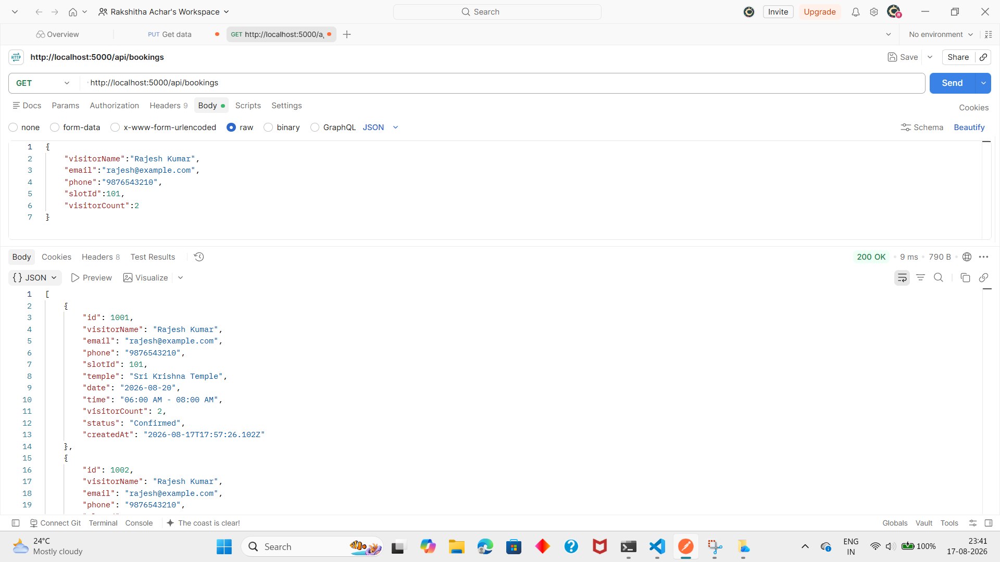

# Sri Krishna Temple - Darshan Booking System

# Project Description

Sri Krishna Temple Darshan Booking System is a web application that
allows users to view available darshan slots, book a slot, check
booking details, and cancel an existing booking.

# Technologies Used

- HTML
- CSS
- JavaScript
- Node.js
- Express.js

# Features

- View available darshan time slots
- Book a darshan slot
- Generate a Booking ID
- Search booking details
- Cancel a booking
- Update available slot capacity

# Project Structure

- index.html - Frontend webpage
- server.js - Backend server
- package.json - Project dependencies
- screenshots/ - Screenshots of the working application

# Setup Instructions

 Step 1: Open the project folder

Open the temple-booking-backend folder in VS Code.

 Step 2: Install dependencies

Open the VS Code terminal and run:

    npm install

Step 3: Start the server

Run:

    node server.js

 Step 4: Open the website

Open your browser and go to:

 http://localhost:5000   

# API Endpoints

| Method        | Endpoint              | Purpose                     |

| GET           | /api/slots            | Get available darshan slots |
| POST          | /api/bookings         | Create a new booking        |
| GET           | /api/bookings         | Fetch all bookings          | 
| GET           | /api/bookings/:id     | Find booking details        |
| PUT           | /api/bookings/:id     | Update booking details      |
| DELETE        | /api/bookings/:id     | Cancel a booking            |

# How the System Works

1. The user opens the website.
2. Available darshan slots are displayed.
3. The user enters visitor details.
4. The user selects a time slot and number of visitors.
5. The booking is submitted to the backend.
6. The system generates a Booking ID.
7. The user can search for the booking using the Booking ID.
8. The user can cancel the booking if required.

# Screenshots

Example:

# Short Explanation

   This project provides a simple online system for managing temple
darshan bookings. The frontend is developed using HTML, CSS and
JavaScript, while Node.js and Express.js are used for the backend.
REST APIs connect the frontend with the backend for slot viewing,
booking, searching and cancellation.

